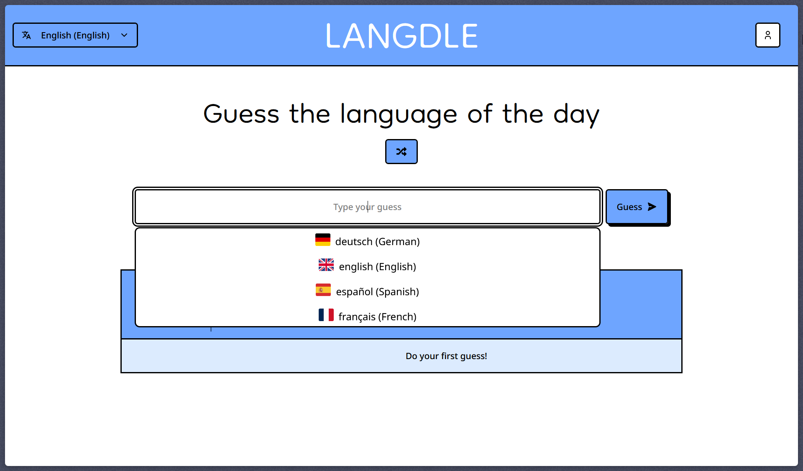
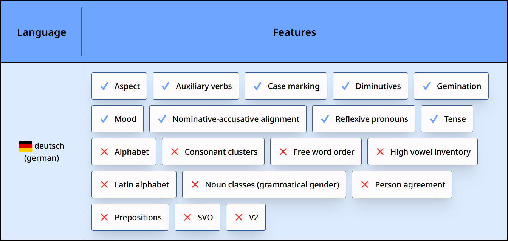
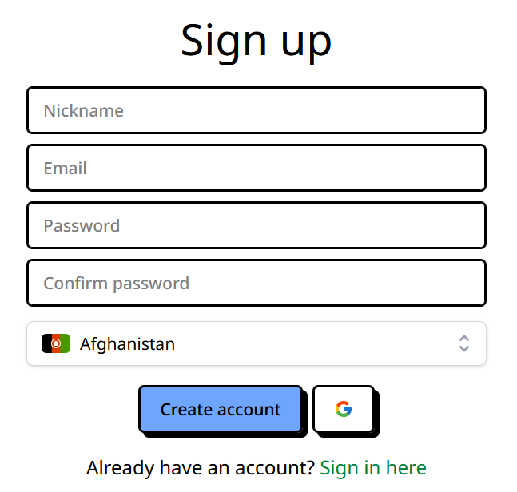
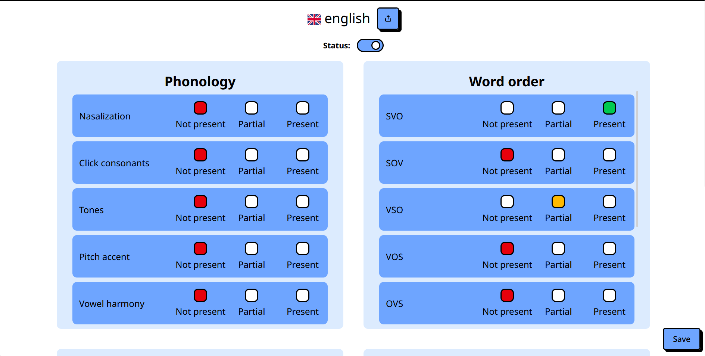

Langdle es un puzzle lingüístico diario inspirado en Wordle. En lugar de adivinar una
palabra, adivinas un **idioma natural** basándote en sus características tipológicas y
fonológicas. Cada intento revela qué tan cerca estás, resaltando las características
que el idioma que elegiste comparte con el idioma misterioso.

## Cómo funciona

Cada día se selecciona un idioma objetivo. Comienzas sin ninguna información — tu primer
intento es básicamente a ciegas. Después de cada intento, el juego compara el idioma
que elegiste con el objetivo y muestra qué **características lingüísticas** tienen en común:

- Sistema de escritura (Alfabeto, Abyad, Abugida, Logográfico...)
- Orden de palabras (SVO, SOV, VSO...)
- Tipo morfológico (aislante, aglutinante, fusional...)
- Características fonológicas (tonos, consonantes clic, armonía vocálica...)

Las características compartidas se iluminan, dándote pistas para reducir tu siguiente intento.

## Stack tecnológico

Construido con **Next.js** y **React** en el frontend, estilizado con **Tailwind CSS**, y
respaldado por un backend en **Node.js** conectado a una base de datos **PostgreSQL**. El
estado del servidor se gestiona con **TanStack Query** para un caché eficiente y
actualización en segundo plano.

## Autenticación

Los usuarios pueden iniciar sesión con **correo y contraseña** o mediante **Google OAuth**.
Las sesiones se persisten para que tu progreso diario se guarde en todos tus dispositivos.

## Panel de control

Un panel de administración permite configurar el conjunto completo de características
lingüísticas rastreadas por el juego — añadiendo nuevos idiomas, editando sus atributos
y programando qué idioma aparece en un día determinado.

